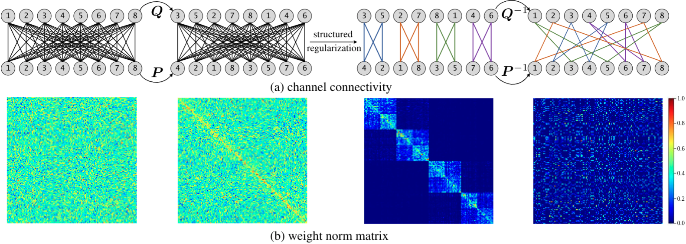

# Structured Sparsification with Joint Optimization of Group Convolution and Channel Shuffle

Official implementation of paper: **Structured Sparsification with Joint Optimization of Group Convolution and Channel Shuffle** (UAI 2021), by Xin-Yu Zhang, Kai Zhao, Taihong Xiao, Ming-Ming Cheng, and Ming-Hsuan Yang. [[paper](https://arxiv.org/abs/2002.08127), [poster](images/aistats-poster.pdf), [video](images/8min-video.mp4), [short slides](images/brief-slides.pdf), [full slides](images/full-slides.pdf)]

## Introduction

This repository contains the official implementation of the structured spasification algorithm for model compression, which converts the vanilla convolutions into GroupConvs and learns a channel shuffle pattern between consecutive GroupConvs.

## Overview

<figure>
  
</figure>
